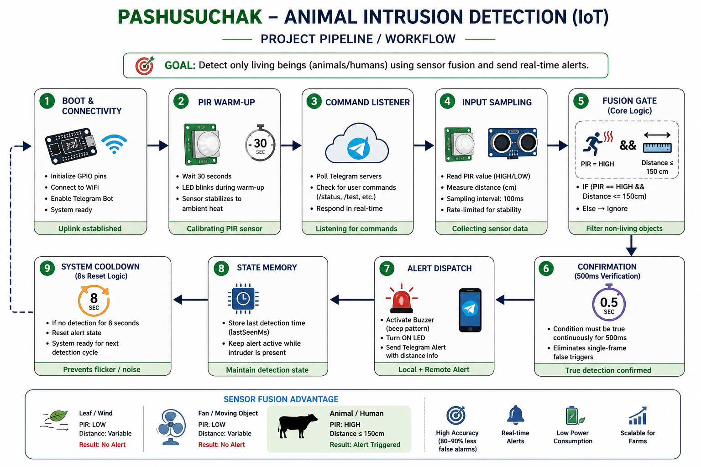
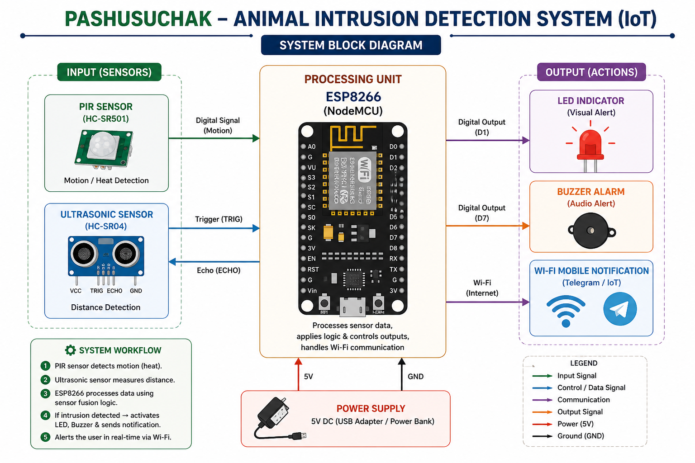
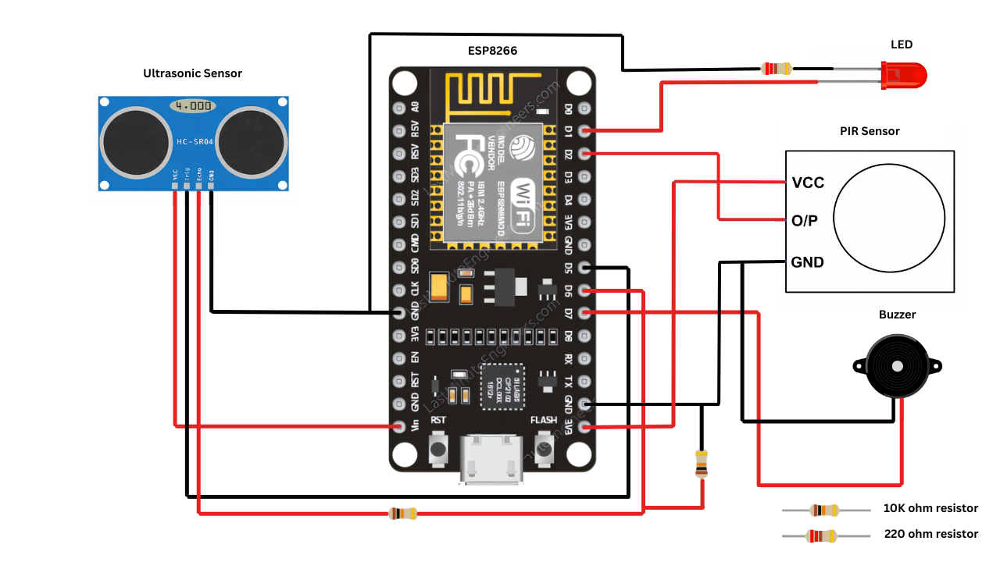

# 🐄 PashuSuchak – Animal Intrusion Detection System (IoT)


---

## 💡 Problem Statement

Animal intrusion in agricultural fields causes significant crop damage. Traditional methods like fencing, manual guarding, or scarecrows are:

- ❌ Inefficient  
- ❌ Labor-intensive  
- ❌ Not scalable  

---

## 🚀 Solution

**PashuSuchak** is a smart IoT-based system that detects **only living beings (animals/humans)** using **sensor fusion (PIR + Ultrasonic)** and triggers alerts in real-time.

> 🎯 Goal: Reduce false alarms and automate farm protection

---

## 📊 Project Pipeline



This system uses a **Sensor Fusion Gate** to detect living beings. By requiring two different physical signatures (heat and presence) to overlap, it achieves near-zero false alarms from inanimate objects like wind or moving fans.

### 🧠 1. System Philosophy
> "True detection requires a heat signature (biological) AND a physical presence (distance). This dual-layer confirmation ensures the system reacts only to living beings."

### 🔄 2. Execution Flow (The Pipeline)

| Stage | Name | Description |
| :--- | :--- | :--- |
| **Stage 1** | **Boot & Init** | Calibrates hardware (30s PIR warm-up) and establishes the Telegram IoT uplink. |
| **Stage 2** | **Command Layer** | Listens for remote Telegram commands (`/status`, `/test`) to interact with the device. |
| **Stage 3** | **Input Layer** | Samples the PIR (heat) and Ultrasonic (distance) sensors every 100ms. |
| **Stage 4** | **Fusion Gate** | **The Logic Check.** Verifies if `PIR == HIGH` AND `Distance < Threshold`. |
| **Stage 5** | **Confirmation** | Ensures the Fusion Gate stays active for **500ms** to filter out momentary noise. |
| **Stage 6** | **Action Layer** | Triggers local alerts (Buzzer/LED) and sends a secure Telegram notification. |
| **Stage 7** | **Memory State** | Keeps the alert active as long as the object is seen, with an 8s cooldown period. |

### ⚖️ 3. Core Logic (The Gate)

The system operates on a strict **Dual-Confirmation** model:

```cpp
IF (PIR Sees Heat) AND (Ultrasonic Sees Object) {
    Wait 500ms to Confirm...
    IF (Still True) -> TRIGGER ALERT! ✅
}
ELSE {
    IGNORE (Could be wind, fan, or inanimate object) ❌
}
```

👉 **Why this is powerful**:
*   **Fans/Balls**: Move but have NO heat signature (PIR = LOW) → **Ignored**.
*   **Wind/Curtains**: Move but have NO heat signature → **Ignored**.
*   **Sunlight/Glitches**: May trigger PIR but have NO physical presence at range → **Ignored**.

---

## 🏗️ System Architecture



---

## 🔌 Circuit Diagram



---

## ⚙️ Hardware Setup


### 🔌 Wiring Table

| Component | NodeMCU Pin | Pin Function |
| :--- | :--- | :--- |
| **PIR Sensor (OUT)** | **D2** | Motion Signal (Input) |
| **Ultrasonic (TRIG)** | **D5** | Trigger Pulse (Output) |
| **Ultrasonic (ECHO)** | **D6** | Echo Pulse (Input) |
| **LED Indicator** | **D1** | Visual Alert (Output) |
| **Buzzer** | **D7** | Audio Alert (Output) |
| **VCC (All)** | **3V3 / Vin** | Power (Check sensor voltage) |
| **GND (All)** | **GND** | Ground |

> 💡 **Note**: The HC-SR04 ultrasonic sensor typically requires 5V. You can connect it to the `Vin` pin if you are powering the NodeMCU via USB.

---

## 🧰 Tech Stack

### 🔌 Hardware

* ESP8266 (NodeMCU)
* PIR Sensor (HC-SR501)
* Ultrasonic Sensor (HC-SR04)
* LED Indicator
* Buzzer
* Resistors (220Ω, 10kΩ)
* Breadboard & Jumper Wires
* Power Supply (5V)

### 💻 Software

* Arduino IDE
* ESP8266WiFi Library
* Serial Monitor
* Telegram Bot (for notifications)

---

## 🚀 Getting Started

Follow these steps to set up the project on your local machine and deploy it to the ESP8266.

### 1️⃣ Software Prerequisites
*   **Arduino IDE**: Download and install the latest version from [arduino.cc](https://www.arduino.cc/en/software).
*   **USB Drivers**: If your computer doesn't recognize the NodeMCU, install the **CP210x** or **CH340** drivers (depending on your board version).

### 2️⃣ Setting up Arduino IDE for ESP8266
1.  Open Arduino IDE, go to **File > Preferences**.
2.  In "Additional Boards Manager URLs", paste this link:
    `http://arduino.esp8266.com/stable/package_esp8266com_index.json`
3.  Go to **Tools > Board > Boards Manager...**.
4.  Search for `esp8266` and click **Install**.

### 3️⃣ Installing Required Libraries
Go to **Sketch > Include Library > Manage Libraries...** and install:
*   **UniversalTelegramBot** (by Brian Lough)
*   **ArduinoJson** (by Benoit Blanchon) — *Note: Use version 6.x for compatibility.*

### 4️⃣ Telegram Bot Configuration
1.  Search for **@BotFather** on Telegram and send `/newbot`.
2.  Follow the instructions to get your **Bot Token**.
3.  Search for **@myidbot** and send `/getid` to get your **Chat ID**.

### 5️⃣ Code Configuration & Upload
1.  Navigate to the `code/pashusuchak-iot/` directory and open `pashusuchak-iot.ino`.
2.  In the code, update the following placeholders:
    ```cpp
    const char* ssid     = "YOUR_WIFI_SSID";
    const char* password = "YOUR_WIFI_PASSWORD";
    #define BOT_TOKEN      "YOUR_TELEGRAM_BOT_TOKEN"
    #define CHAT_ID        "YOUR_TELEGRAM_CHAT_ID"
    ```
3.  Connect your NodeMCU to your PC via USB.
4.  Go to **Tools > Board** and select **NodeMCU 1.0 (ESP-12E Module)**.
5.  Go to **Tools > Port** and select the correct COM port.
6.  Click the **Upload** button (arrow icon).

---

## 🛠️ Detailed Setup Guides

### 🤖 1. Setting up the Telegram Bot (BotFather)

This system uses Telegram to send real-time alerts. Follow these steps to create your own bot:

1.  **Open Telegram**: Search for [@BotFather](https://t.me/botfather) in your Telegram app.
2.  **Create Bot**: Send the command `/newbot` to BotFather.
3.  **Name Your Bot**: Choose a display name (e.g., `PashuSuchak_Bot`).
4.  **Choose Username**: Choose a unique username ending in `bot` (e.g., `my_pashu_alerts_bot`).
5.  **Get API Token**: BotFather will send you an **API Token**. Copy this; you will need to paste it into the code.
6.  **Find Your Chat ID**:
    *   Search for [@myidbot](https://t.me/myidbot) and send `/getid`.
    *   Copy the numeric **Chat ID**. This ensures the bot sends alerts only to *you*.
7.  **Start the Bot**: Click the link to your bot (provided by BotFather) and press **START**.

### 📚 2. Installing Libraries in Arduino IDE

For the code to compile, you must install these specific libraries:

1.  **Open Library Manager**: Go to **Sketch > Include Library > Manage Libraries...** (or press `Ctrl+Shift+I`).
2.  **Install UniversalTelegramBot**:
    *   Search for `UniversalTelegramBot`.
    *   Install the version by **Brian Lough**.
3.  **Install ArduinoJson**:
    *   Search for `ArduinoJson`.
    *   **IMPORTANT**: Install **Version 6.x** (e.g., 6.19.4). Do not use version 7.x as it may have compatibility issues with older bot libraries.
4.  **Check ESP8266WiFi**: This library is usually included automatically when you install the ESP8266 board package, so no extra steps are needed.

---

## ⚙️ How It Works
1.  **PIR** detects motion heat signature.
2.  **Ultrasonic** measures physical distance.
3.  **ESP8266** processes both signals via the Fusion Gate.
4.  **If valid detection**:
    *   🔔 Buzzer ON
    *   💡 LED ON
    *   📱 Telegram Alert sent via WiFi

---

## 📊 Results
*   ✔ **80–90% reduction** in false alarms.
*   ✔ Accurate detection of living beings only.
*   ✔ Real-time alert system with IoT connectivity.
*   ✔ Low-cost, easy-to-deploy solution.

---

## 🚀 Features
*   ✅ **Sensor Fusion**: High accuracy biological detection.
*   ✅ **Real-time Alerts**: IoT-enabled notifications.
*   ✅ **Low Power**: Optimized for long-term farm use.
*   ✅ **Scalable**: Easy to deploy across large agricultural areas.

---

## ⚠️ Limitations
*   Cannot classify specific animal types.
*   Depends on optimal sensor placement.
*   Limited ultrasonic range (~4 meters).

---

## 🔮 Future Scope

* 🤖 AI-based animal recognition (camera integration)
* 📱 Mobile app dashboard
* ☀ Solar-powered deployment
* 🌐 Cloud-based monitoring system

---

## 🛠️ Troubleshooting

*   **PIR Always HIGH**: The PIR sensor needs about 30–60 seconds to warm up after powering on. If it stays HIGH, try adjusting the sensitivity potentiometer (labeled 'SENS') on the sensor.
*   **Ultrasonic Readings at -1**: Check your wiring (VCC, GND, TRIG, ECHO). Ensure the sensor is powered with 5V.
*   **No Telegram Notifications**: 
    *   Verify your `BOT_TOKEN` and `CHAT_ID`.
    *   Ensure the ESP8266 is connected to the internet (check Serial Monitor).
*   **Serial Monitor Gibberish**: Ensure the baud rate is set to **115200** in the Arduino Serial Monitor.

---

## 📁 Project Structure

```text
pashusuchak-iot/
├── code/
│   └── pashusuchak-iot/
│       └── pashusuchak-iot.ino  # Main source code
├── assets/                      # Images, circuit diagrams, and photos
├── docs/                        # Research papers, PPTs, and reports
└── README.md                    # Project documentation
```

---

## 🧠 Real-World Applications

* Smart agriculture
* Farm security systems
* Wildlife monitoring
* Smart fencing solutions

---

## 📄 Research Insight

Common issues in existing systems:

* Single sensor → high false alarms
* No distance verification
* No remote alert system
* Expensive AI-based solutions

👉 This project solves these using **low-cost IoT + sensor fusion**

---

## 👨💻 Authors

* Sumeet Prajapati
* Chinmay Sonar
* Rishabh Tripathi
* Keegan Pinto

---

## 🏫 Institution

St. Francis Institute of Technology
(Mini Project – Sensor Lab)

---

## ❤️ Final Note
> This project proves that simple sensor fusion + IoT can outperform complex systems in real-world scenarios.
